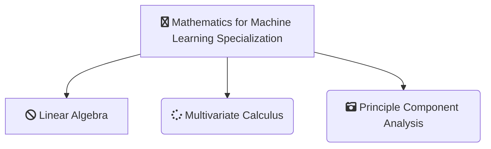

-------------------------------------------------------------------------------------------

-------------------------------------------------------------------------------------------

# [Imperial College of London - Mathematics for Machine Learning Specialization](https://www.coursera.org/specializations/mathematics-machine-learning?)
*This Repository Contains Solution to the Assignments of the Mathematics for Machine Learning Specialization from Imperial College of London on Coursera Taught by 
[David Dye](https://www.coursera.org/instructor/david-dye),
[Samuel J. Cooper](https://www.coursera.org/instructor/samuel-cooper),
[A. Freddie Page](https://www.coursera.org/instructor/freddie-page),
[Marc Peter Deisenroth](https://www.coursera.org/instructor/marc-deisenroth)*

# About

-------------------------------------------------------------------------------------------

## WHAT YOU WILL LEARN

- Implement mathematical concepts using real-world data
- Derive PCA from a projection perspective
- Understand how orthogonal projections work
- Master PCA

---

## About this Specialization

For a lot of higher level courses in Machine Learning and Data Science, you find you need to freshen up on the basics in mathematics - stuff you may have studied before in school or university, but which was taught in another context, or not very intuitively, such that you struggle to relate it to how it’s used in Computer Science. This specialization aims to bridge that gap, getting you up to speed in the underlying mathematics, building an intuitive understanding, and relating it to Machine Learning and Data Science.

In the first course on Linear Algebra we look at what linear algebra is and how it relates to data. Then we look through what vectors and matrices are and how to work with them.

The second course, Multivariate Calculus, builds on this to look at how to optimize fitting functions to get good fits to data. It starts from introductory calculus and then uses the matrices and vectors from the first course to look at data fitting.

The third course, Dimensionality Reduction with Principal Component Analysis, uses the mathematics from the first two courses to compress high-dimensional data. This course is of intermediate difficulty and will require Python and numpy knowledge.

At the end of this specialization you will have gained the prerequisite mathematical knowledge to continue your journey and take more advanced courses in machine learning.

---

## Applied Learning Project
Through the assignments of this specialisation you will use the skills you have learned to produce mini-projects with Python on interactive notebooks, an easy to learn tool which will help you apply the knowledge to real world problems. For example, using linear algebra in order to calculate the page rank of a small simulated internet, applying multivariate calculus in order to train your own neural network, performing a non-linear least squares regression to fit a model to a data set, and using principal component analysis to determine the features of the MNIST digits data set.

-------------------------------------------------------------------------------------------------------------

## There are 3 Courses in this Specialization

### COURSE 1
### Mathematics for Machine Learning: Linear Algebra

In this course on Linear Algebra we look at what linear algebra is and how it relates to vectors and matrices. Then we look through what vectors and matrices are and how to work with them, including the knotty problem of eigenvalues and eigenvectors, and how to use these to solve problems. Finally  we look at how to use these to do fun things with datasets - like how to rotate images of faces and how to extract eigenvectors to look at how the Pagerank algorithm works.

Since we're aiming at data-driven applications, we'll be implementing some of these ideas in code, not just on pencil and paper. Towards the end of the course, you'll write code blocks and encounter Jupyter notebooks in Python, but don't worry, these will be quite short, focussed on the concepts, and will guide you through if you’ve not coded before.

At the end of this course you will have an intuitive understanding of vectors and matrices that will help you bridge the gap into linear algebra problems, and how to apply these concepts to machine learning.

* [Mathematics for Machine Learning: Linear Algebra](https://github.com/shantanu1109/Coursera-Imperial-College-of-London-Mathematics-For-Machine-Learning-Specialization/tree/main/Course-1-Mathematics%20for%20Machine%20Learning:%20Linear%20Algebra)

### COURSE 2
### Mathematics for Machine Learning: Multivariate Calculus

This course offers a brief introduction to the multivariate calculus required to build many common machine learning techniques. We start at the very beginning with a refresher on the “rise over run” formulation of a slope, before converting this to the formal definition of the gradient of a function. We then start to build up a set of tools for making calculus easier and faster. Next, we learn how to calculate vectors that point up hill on multidimensional surfaces and even put this into action using an interactive game. We take a look at how we can use calculus to build approximations to functions, as well as helping us to quantify how accurate we should expect those approximations to be. We also spend some time talking about where calculus comes up in the training of neural networks, before finally showing you how it is applied in linear regression models. This course is intended to offer an intuitive understanding of calculus, as well as the language necessary to look concepts up yourselves when you get stuck. Hopefully, without going into too much detail, you’ll still come away with the confidence to dive into some more focused machine learning courses in future.

* [Mathematics for Machine Learning: Multivariate Calculus](https://github.com/shantanu1109/Coursera-Imperial-College-of-London-Mathematics-For-Machine-Learning-Specialization/tree/main/Course-2-Mathematics%20for%20Machine%20Learning:%20Multivariate%20Calculus)

### COURSE 3
### Mathematics for Machine Learning: PCA

This intermediate-level course introduces the mathematical foundations to derive Principal Component Analysis (PCA), a fundamental dimensionality reduction technique. We'll cover some basic statistics of data sets, such as mean values and variances, we'll compute distances and angles between vectors using inner products and derive orthogonal projections of data onto lower-dimensional subspaces. Using all these tools, we'll then derive PCA as a method that minimizes the average squared reconstruction error between data points and their reconstruction.

At the end of this course, you'll be familiar with important mathematical concepts and you can implement PCA all by yourself. If you’re struggling, you'll find a set of jupyter notebooks that will allow you to explore properties of the techniques and walk you through what you need to do to get on track. If you are already an expert, this course may refresh some of your knowledge.

The lectures, examples and exercises require:
1. Some ability of abstract thinking
2. Good background in linear algebra (e.g., matrix and vector algebra, linear independence, basis)
3. Basic background in multivariate calculus (e.g., partial derivatives, basic optimization)
4. Basic knowledge in python programming and numpy

* [Mathematics for Machine Learning: PCA](https://github.com/shantanu1109/Coursera-Imperial-College-of-London-Mathematics-For-Machine-Learning-Specialization/tree/main/Course-3-Mathematics%20for%20Machine%20Learning:%20PCA)

-------------------------------------------------------------------------------------------------------------

## Certificate

1. [Mathematics for Machine Learning: Linear Algebra](https://www.coursera.org/account/accomplishments/verify/S8WAEQ2VPKDK)
2. [Mathematics for Machine Learning: Multivariate Calculus](https://www.coursera.org/account/accomplishments/verify/MGJS87FW7MSL)
3. [Mathematics for Machine Learning: PCA]()
4. [Mathematics for Machine Learning Specialization (Final Certificate)]()

--------------------------------------------------------------------------------------------------------------

## References
1. [Mathematics for Machine Learning: Linear Algebra](https://www.coursera.org/learn/linear-algebra-machine-learning?specialization=mathematics-machine-learning)
2. [Mathematics for Machine Learning: Multivariate Calculus](https://www.coursera.org/learn/multivariate-calculus-machine-learning?specialization=mathematics-machine-learning)
3. [Mathematics for Machine Learning: PCA](https://www.coursera.org/learn/pca-machine-learning?specialization=mathematics-machine-learning)

----------------------------------------------------------------------------------------------------------------

## 📝 Disclaimer 
I made this repository as *a reference*. Please do not copy paste the solution as is. You can find the solution if you read the instruction carefully. 

 
## 📝 License
The gem is available as open source under the terms of the [MIT License](https://opensource.org/licenses/MIT).
 
-----------------------------------------------------------------------------------------------------------------

