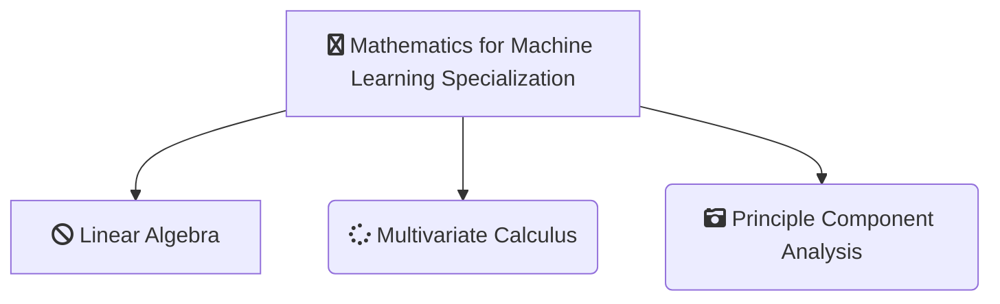

-------------------------------------------------------------------------------------------

-------------------------------------------------------------------------------------------

# [Imperial College of London - Mathematics for Machine Learning Specialization](https://www.coursera.org/specializations/mathematics-machine-learning?)
*This Repository Contains Solution to the Assignments of the Mathematics for Machine Learning Specialization from Imperial College of London on Coursera Taught by 
[David Dye](https://www.coursera.org/instructor/david-dye),
[Samuel J. Cooper](https://www.coursera.org/instructor/samuel-cooper),
[A. Freddie Page](https://www.coursera.org/instructor/freddie-page),
[Marc Peter Deisenroth](https://www.coursera.org/instructor/marc-deisenroth)*

# About

-------------------------------------------------------------------------------------------

## WHAT YOU WILL LEARN

- Implement mathematical concepts using real-world data
- Derive PCA from a projection perspective
- Understand how orthogonal projections work
- Master PCA

---

## About this Specialization

For a lot of higher level courses in Machine Learning and Data Science, you find you need to freshen up on the basics in mathematics - stuff you may have studied before in school or university, but which was taught in another context, or not very intuitively, such that you struggle to relate it to how it’s used in Computer Science. This specialization aims to bridge that gap, getting you up to speed in the underlying mathematics, building an intuitive understanding, and relating it to Machine Learning and Data Science.

In the first course on Linear Algebra we look at what linear algebra is and how it relates to data. Then we look through what vectors and matrices are and how to work with them.

The second course, Multivariate Calculus, builds on this to look at how to optimize fitting functions to get good fits to data. It starts from introductory calculus and then uses the matrices and vectors from the first course to look at data fitting.

The third course, Dimensionality Reduction with Principal Component Analysis, uses the mathematics from the first two courses to compress high-dimensional data. This course is of intermediate difficulty and will require Python and numpy knowledge.

At the end of this specialization you will have gained the prerequisite mathematical knowledge to continue your journey and take more advanced courses in machine learning.

---

## Applied Learning Project
Through the assignments of this specialisation you will use the skills you have learned to produce mini-projects with Python on interactive notebooks, an easy to learn tool which will help you apply the knowledge to real world problems. For example, using linear algebra in order to calculate the page rank of a small simulated internet, applying multivariate calculus in order to train your own neural network, performing a non-linear least squares regression to fit a model to a data set, and using principal component analysis to determine the features of the MNIST digits data set.

-------------------------------------------------------------------------------------------------------------

## There are 3 Courses in this Specialization

### COURSE 1
### Supervised Machine Learning: Regression and Classification

In the first course of the Machine Learning Specialization, you will:
- Build machine learning models in Python using popular machine learning libraries NumPy and scikit-learn.
- Build and train supervised machine learning models for prediction and binary classification tasks, including linear regression and logistic regression

* [Supervised Machine Learning: Regression and Classification](https://github.com/shantanu1109/Coursera-DeepLearning.AI-Stanford-University-Machine-Learning-Specialization/tree/main/Course-1-Supervised-Machine-Learning-Regression-and-Classification)

### COURSE 2
### Advanced Learning Algorithms

In the second course of the Machine Learning Specialization, you will:
- Build and train a neural network with TensorFlow to perform multi-class classification
- Apply best practices for machine learning development so that your models generalize to data and tasks in the real world
- Build and use decision trees and tree ensemble methods, including random forests and boosted trees

* [Advanced Learning Algorithms](https://github.com/shantanu1109/Coursera-DeepLearning.AI-Stanford-University-Machine-Learning-Specialization/tree/main/Course-2-Advanced-Learning-Algorithms)

### COURSE 3
### Unsupervised Learning, Recommenders, Reinforcement Learning
In the third course of the Machine Learning Specialization, you will:
- Use unsupervised learning techniques for unsupervised learning: including clustering and anomaly detection.
- Build recommender systems with a collaborative filtering approach and a content-based deep learning method.
- Build a deep reinforcement learning model.

* [Unsupervised Learning, Recommenders, Reinforcement Learning](https://github.com/shantanu1109/Coursera-DeepLearning.AI-Stanford-University-Machine-Learning-Specialization/tree/main/Course-3-Unsupervised-Learning-Recommenders-Reinforcement-Learning)

-------------------------------------------------------------------------------------------------------------

## Certificate

1. [Supervised Machine Learning: Regression and Classification](https://www.coursera.org/account/accomplishments/verify/77SF7ZRAHG2S)
2. [Advanced Learning Algorithms](https://www.coursera.org/account/accomplishments/verify/EYY44BAYYAGU)
3. [Unsupervised Learning, Recommenders, Reinforcement Learning](https://www.coursera.org/account/accomplishments/verify/DZGJW22HB7VZ)
4. [Machine Learning Specialization (Final Certificate)](https://www.coursera.org/account/accomplishments/specialization/8F3W88UHF7CL)

--------------------------------------------------------------------------------------------------------------

## References
1. [Supervised Machine Learning: Regression and Classification](https://www.coursera.org/learn/machine-learning?specialization=machine-learning-introduction)
2. [Advanced Learning Algorithms](https://www.coursera.org/learn/advanced-learning-algorithms?specialization=machine-learning-introduction)
3. [Unsupervised Learning, Recommenders, Reinforcement Learning](https://www.coursera.org/learn/unsupervised-learning-recommenders-reinforcement-learning?specialization=machine-learning-introduction)

----------------------------------------------------------------------------------------------------------------

## 📝 Disclaimer 
I made this repository as *a reference*. Please do not copy paste the solution as is. You can find the solution if you read the instruction carefully. 

 
## 📝 License
The gem is available as open source under the terms of the [MIT License](https://opensource.org/licenses/MIT).
 
-----------------------------------------------------------------------------------------------------------------

